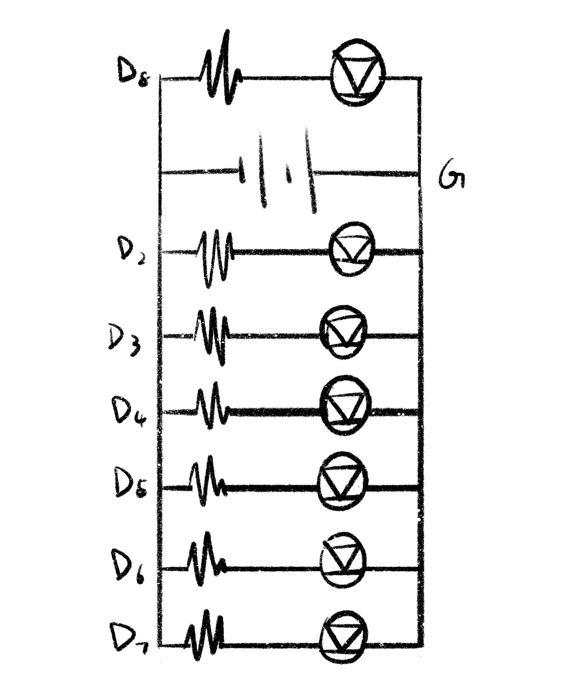

# HW10
 
I originally wanted to use 6 LEDs to indicate a minute and then a new LED to indicate that a minute has passed. 
But I found that once I had the first LED on from the start, I needed to add another LED. 
But I didn't take enough LED lights and resistors. 
So, I let the 6 LED light up in sequence every 10 seconds (that is, after 50 seconds) 
and stay on for 10 seconds to represent the last 10 seconds, after that the seventh LED lights up, and continues keep it lit.

During this whole process, I found that the interesting point is 
that because the resistors and LEDs are connected by exposed metal wires, 
when there are many LEDs and resistors on the breadboard, 
some of the metal wires will touch each other and let two LEDs light at the same time. 
At first I thought it was something wrong in my code, 
but after checking for a long time I discovered that the metal parts of the two LEDs were in contact with each other.
